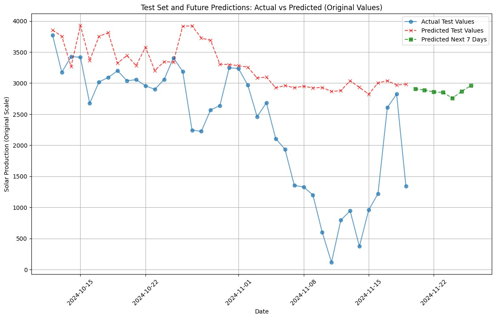
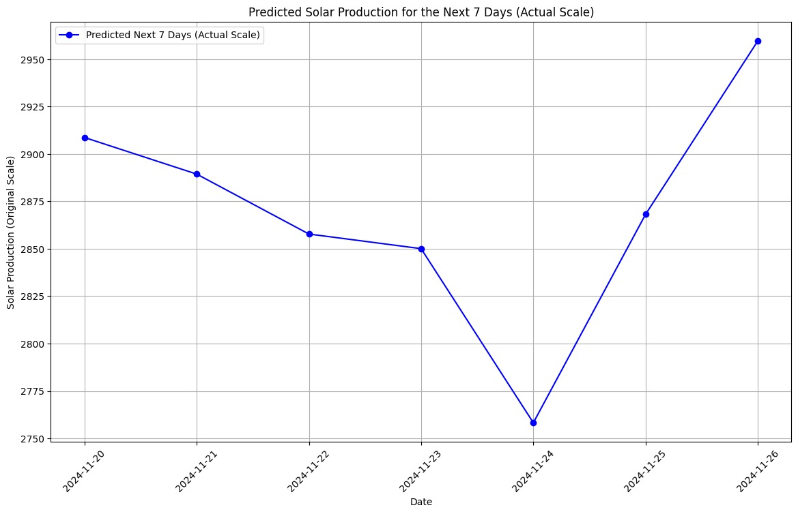
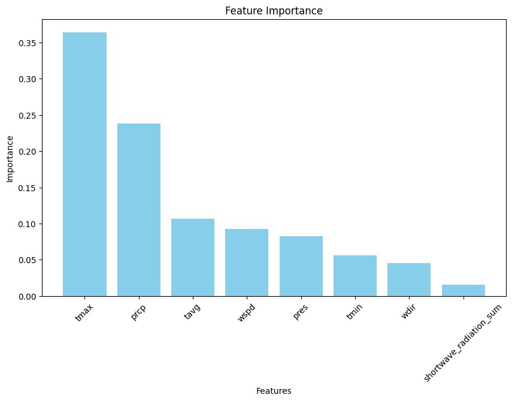

# Solar Energy Production Forecasting

## Introduction
This project predicts the energy production of a solar system using various machine learning models. The goal is to provide accurate energy forecasts to aid in better solar energy management and utilization. After training and tuning several models, the Random Forest Regression model was selected as the best-performing model for this task. A web-based user interface has been deployed to provide real-time forecasts.

## Installation Instructions
1. Clone the repository:
   ```bash
   git clone https://github.com/musham101/solar-energy-prediction.git
   ```
2. Navigate to the project directory:
   ```bash
   cd solar-energy-forecasting
   ```
3. Install the required dependencies:
   ```bash
   pip install -r requirements.txt
   ```
4. Access the inference URL:
   ```bash
   http://15.206.128.214/solar_forcast/
   ```

## Usage Guide
- Access the user interface at: [Solar Forecast UI](http://15.206.128.214/solar_forcast/)
- Upload or input the required parameters to generate energy production forecasts.
- Review the predictions directly on the UI.

## Results and Visuals

### Model Performance
The Random Forest Regression model was chosen as the best-performing model after comparing results from:
- Regression
- ARIMA
- SARIMA
- Prophet
- Random Forest Regression

Key metrics and visuals from the evaluation process include:

#### Test Set and Future Predictions
This plot compares actual test values with predicted values and includes forecasts for the next 7 days:



#### Predicted Solar Production for the Next 7 Days
This plot shows the detailed predictions for solar energy production over the next 7 days:



#### Feature Importance
The feature importance plot highlights the significance of input variables used by the Random Forest Regression model:



## License Information
This project is licensed under the MIT License. See the `LICENSE` file for details.
